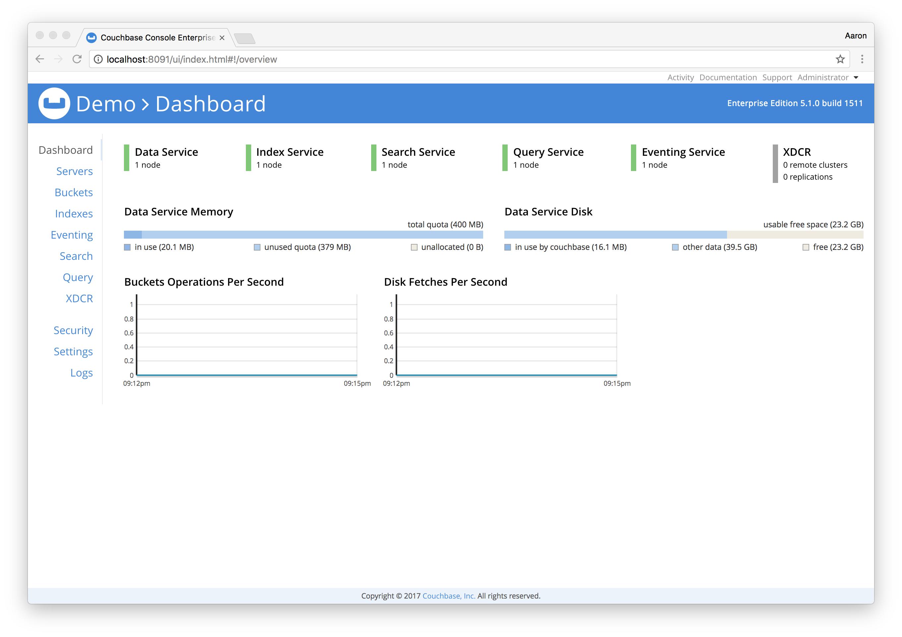
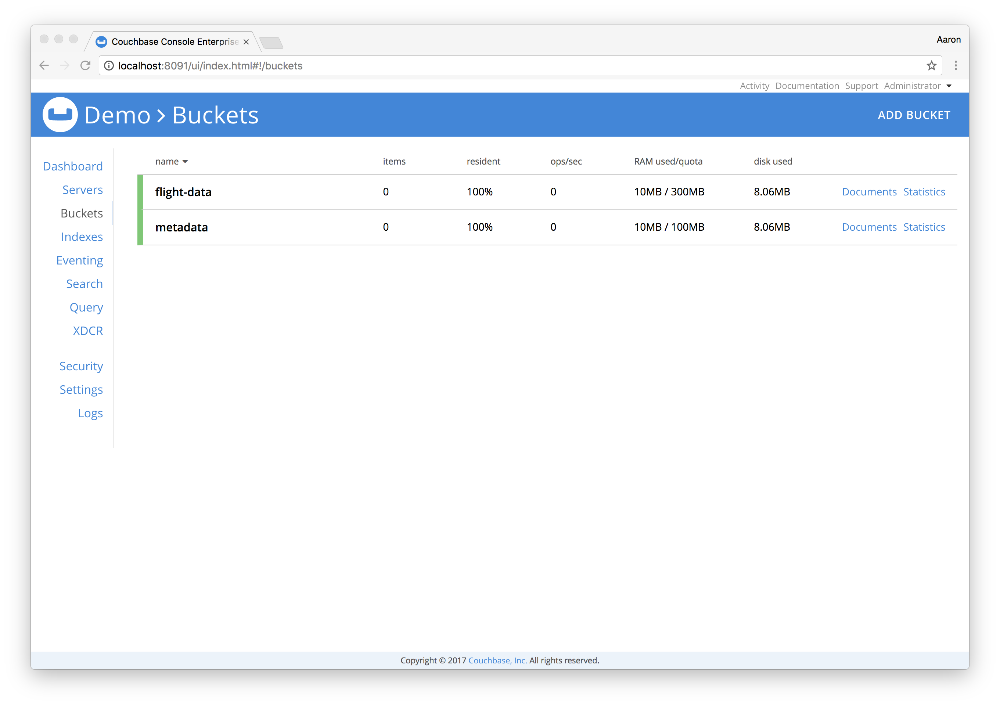
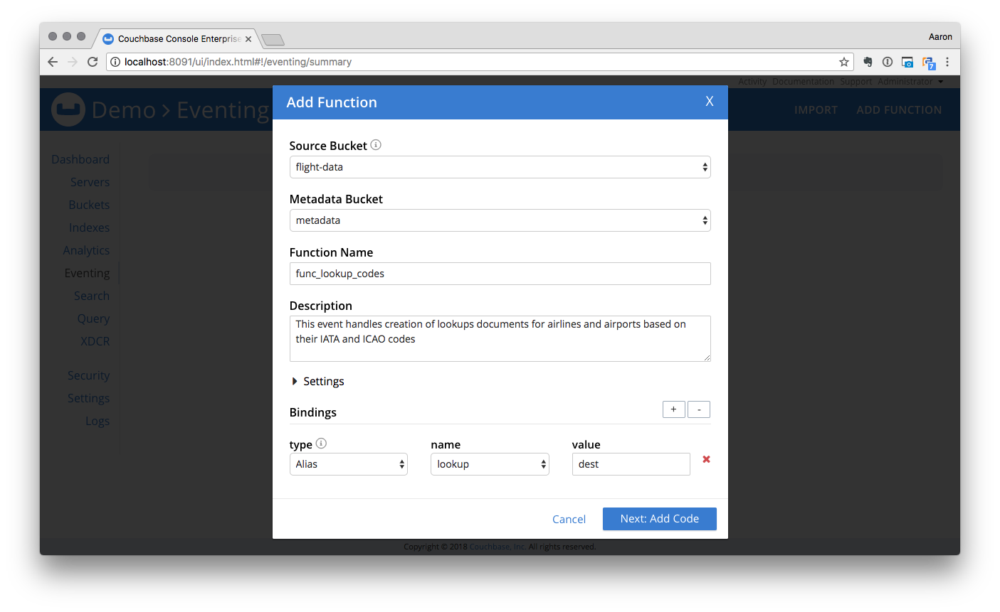
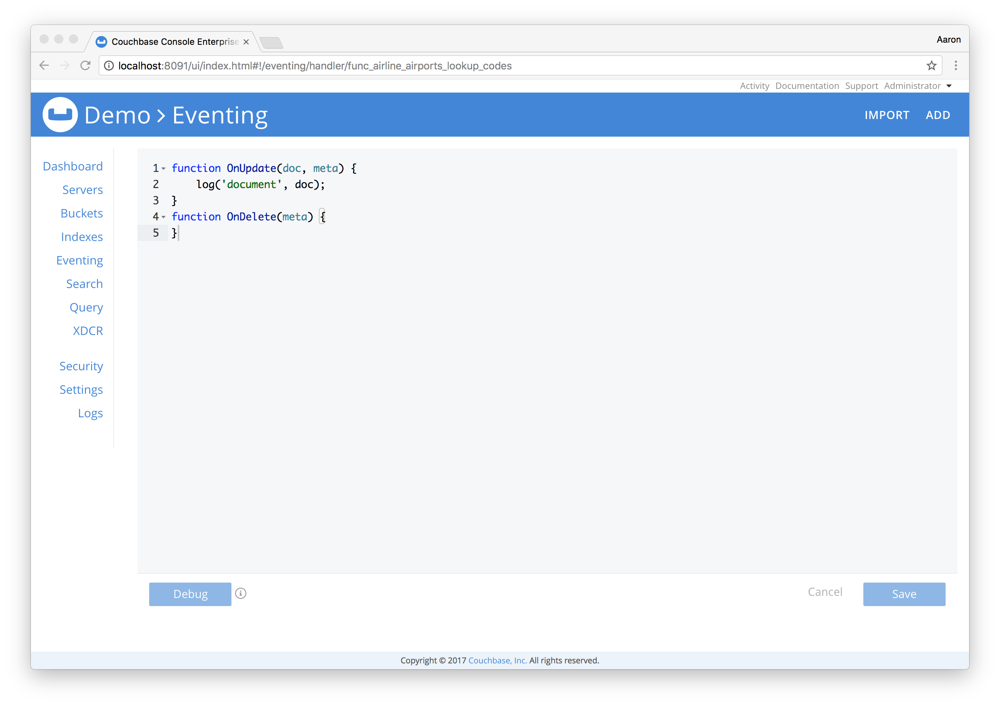

# Eventing Airlines and Airports Lookup Demo

--

## Setup

Clone this repository

```bash
git clone https://github.com/bentonam/couchbase-eventing-lookup-demo.git
```
`cd` into the project directory

Go ahead and open up the project in your favorite IDE, if you using Atom just run `atom .` from terminal

This demo runs in a single Docker container, from terminal run the following command:

**Note:** Replace `$URL_TO_BUILD` with a valid rpm build

```bash
docker-compose build \
	--build-arg PACKAGE_URL=$URL_TO_BUILD \
	couchbase
```

This will build and tag the container.  The build reference that I'm using at this time is #1511.

Now start the container

```bash
docker-compose up -d
```

After a few seconds, the Couchbase container will be up and running.  This container has the following services enabled:

- Data
- Index
- Search
- Query
- Eventing

You can open the admin console by going to [http://localhost:8091/ui/index.html]() in a web browser.  The default username is `Administrator` and the `password` is password.  You can change these if you'd like in the `docker-compose.yaml` file.  



Browse to the [Buckets](http://localhost:8091/ui/index.html#!/buckets) tag and you will see there are three buckets created for you `flight-data`, `lookup` and `metadata`



## Models

This is an Airline / Airport lookup application that uses N1QL.  After loading our initial dataset, we will walk through several different ways to query the dataset, create indexes, and look at how we can perform the same queries without GSI indexes using lookup documents / inverted indexes.

We will have 3 different models in our dataset, 2 of which we will review now.  The airline and airports models are pretty self explanatory and contain information that you would expect to see.  Generally, almost all airlines and airports are assigned both an [IATA](http://www.iata.org/about/members/Pages/airline-list.aspx?All=true) (International Air Transport Association) and [ICAO](http://www.icao.int/) (International Civil Aviation Organization) or [FAA](http://www.faa.gov/) (Federal Aviation Administration)

- Airlines:
	- IATA / FAA: 2 characters
	- ICAO: 3 Characters
- Airports:
	- IATA / FAA: 3 characters
	- ICAO: 4 Characters

Our application will need to find airlines and airports based on their identifying IATA / ICAO / FAA code.  

### Airline

```json
{
  "_id": "airline::2009",
  "_type": "airline",
  "airline_id": 2009,
  "airline_name": "Delta Air Lines",
  "airline_iata": "DL",
  "airline_icao": "DAL",
  "callsign": "DELTA",
  "iso_country": "US",
  "active": true
}
```

#### Airport

```json
{
  "_id": "airport::3605",
  "_type": "airport",
  "airport_id": 3605,
  "airport_ident": "KICT",
  "airport_type": "large_airport",
  "airport_name": "Wichita Dwight D. Eisenhower National Airport",
  "geo": {
    "latitude": 37.64989853,
    "longitude": -97.43309784
  },
  "elevation": 1333,
  "iso_continent": "NA",
  "iso_country": "US",
  "iso_region": "US-KS",
  "municipality": "Wichita",
  "airport_icao": "KICT",
  "airport_iata": "ICT",
  "airport_gps_code": "KICT",
  "airport_local_code": "ICT",
  "timezone_offset": -6,
  "dst": "A",
  "timezone": "America/Chicago"
}
```

## Load Dataset

We need to first load our airline and airport datasets into Couchbase.  Execute the following command:

```bash
docker exec eventing-couchbase \
	fakeit couchbase \
	--server localhost \
	--username Administrator \
	--password password \
	--bucket flight-data \
	/usr/data/models/airlines.yaml,/usr/data/models/airports.yaml
```

This will load the `flight-data` bucket with ~`12,780` documents.  

## Queries

### Airline Codes

Now we want to query the datasets to be able to find airlines and airports based on their IATA or ICAO codes.  While the concept applies to both, for the purposes of this demo we're going to focus on just airlines.  Each Airline has 2 identifying codes a 2 character [IATA](http://www.iata.org/about/members/Pages/airline-list.aspx?All=true) / [FAA](http://www.faa.gov/) Code and a 3 character [ICAO](http://www.icao.int/) code.  Each of these attributes are stored as separate attributes on the airlines document as `airline_iata` and `airline_icao`.

Open the [Query Workbench](http://localhost:8091/ui/index.html#!/query/workbench) and execute the following statements.

##### Index

Create index for Airline IATA codes

```sql
CREATE INDEX idx_airlines_iata_codes ON `flight-data`(
	airline_iata
)
WHERE airline_iata IS NOT NULL
	AND _type = 'airline';
```

Create index for Airline ICAO codes

```sql
CREATE INDEX idx_airlines_icao_codes ON `flight-data`(
	airline_icao
)
WHERE airline_icao IS NOT NULL
	AND _type = 'airline';
```

##### Query

```sql
SELECT airlines.airline_id, airlines.airline_name,
	airlines.airline_iata, airlines.airline_icao
FROM `flight-data` AS airlines
WHERE airlines.airline_iata = 'DL'
	AND airlines._type = 'airline'
UNION
SELECT airlines.airline_id, airlines.airline_name,
	airlines.airline_iata, airlines.airline_icao
FROM `flight-data` AS airlines
WHERE airlines.airline_icao = 'DL'
	AND airlines._type = 'airline'
LIMIT 1;
```

##### Results

```json
[
  {
    "airline_iata": "DL",
    "airline_icao": "DAL",
    "airline_id": 2009,
    "airline_name": "Delta Air Lines"
  }
]
```

Drop the previously created indexes as they will no longer be used.

```sql
DROP INDEX `flight-data`.idx_airlines_iata_codes;
```

```sql
DROP INDEX `flight-data`.idx_airlines_icao_codes;
```

## Lookup Documents

Based on our access pattern we want to ultimately find an airline or airport based on their IATA or ICAO code.  Instead of creating separate indexes to satisfy our predicate, we can create lookup documents and achieve the same result still using N1QL but pure KV operations.  

Lookup documents are traditionally generated and maintained by the application that is writing the data.  Based on our models above, we'll create a lookup document that allows us to work with both airlines and airports.

```json
{
  "_id": "airport::code::KICT",
  "_type": "code",
  "id": 3605,
  "designation": "airport",
  "code_type": "icao",
  "code": "KICT"
}
```

Execute the following command to load the codes documents into the `lookup` bucket.

```bash
docker exec eventing-couchbase \
	fakeit couchbase \
	--server localhost \
	--username Administrator \
	--password password \
	--bucket lookup \
	/usr/data/models/codes.yaml
```

This will take a few seconds, afterwards you'll have about 19k documents in the `lookup` bucket

Our Codes model is keyed by `{{designation}}::code::{{code}}` i.e. `airline::code::DL`.  Because of how these documents are keyed, we do not even need a GSI index.  Using this predictive key pattern the code is used as part of the key name on the codes document.  Code is essentially an inverted index that we can store a small amout of data and get us back to our parent document.

#### Airline Queries

##### Query

Query by the IATA code

```sql
SELECT airlines.airline_id, airlines.airline_name,
	airlines.airline_iata, airlines.airline_icao
FROM `lookup` AS codes
USE KEYS 'airline::code::DL'
INNER JOIN `flight-data` AS airlines
	ON KEYS 'airline::' || TOSTRING( codes.id );
```

Query by the ICAO code

```sql
SELECT airlines.airline_id, airlines.airline_name,
	airlines.airline_iata, airlines.airline_icao
FROM `lookup` AS codes
USE KEYS 'airline::code::DAL'
INNER JOIN `flight-data` AS airlines
	ON KEYS 'airline::' || TOSTRING( codes.id );
```

##### Results

```json
[
  {
    "airline_iata": "DL",
    "airline_icao": "DAL",
    "airline_id": 2009,
    "airline_name": "Delta Air Lines"
  }
]
```

#### Airport Queries

##### Query

Query by the IATA code

```sql
SELECT airports.airport_id, airports.airport_name,
    airports.airport_iata, airports.airport_icao
FROM `lookup` AS codes
USE KEYS 'airport::code::ICT'
INNER JOIN `flight-data` AS airports
	ON KEYS 'airport::' || TOSTRING( codes.id );
```

Query by the ICAO code

```sql
SELECT airports.airport_id, airports.airport_name,
	airports.airport_iata, airports.airport_icao
FROM `lookup` AS codes
USE KEYS 'airport::code::KICT'
INNER JOIN `flight-data` AS airports
	ON KEYS 'airport::' || TOSTRING( codes.id );
```

##### Results

```json
[
  {
    "airport_iata": "ICT",
    "airport_icao": "KICT",
    "airport_id": 3605,
    "airport_name": "Wichita Dwight D. Eisenhower National Airport"
  }
]
```

We could follow these same queries for Airports, but the result is the same.  Using a lookup document / inverted index is the fastest query we can perform using a key lookup and inner join.  

## Events

So why did we go through this exercise?  Up until now, it has been the responsibility of the applications writing data to maintain these lookup documents / inverted indexes at document write time or they may have used the Kafka connector and had a separate application writing these documents, offloading those operations from their main application.  This is a perfect use case for Events to maintain these lookup documents for us.  

Let's start by flushing our `lookup` bucket from the Admin Console or you can run the following command in terminal

```bash
docker exec eventing-couchbase \
	couchbase-cli \
	bucket-flush \
	--cluster localhost \
	--username Administrator \
	--password password \
	--bucket lookup \
	--force
```

From the Admin Console, click on "Eventing"

Click "Add" and fill out the following and then click "Next: Add Code"



Click "Continue"

This will deploy a shell of our function that looks similar to:



Paste the following code into the editor:

```javascript
function OnUpdate(doc, meta) {
  try {
	    // make sure the document is only an airline or airport document
	    if (
	        doc._type &&
	        'airline,airport'.indexOf(doc._type) !== -1
	    ) {
	        // loop over the 3 code types and use dynamic references of the
	        // _type + code for population
	        var codes = [ 'iata', 'icao' ];
	        for (var i = 0; i < codes.length; i++) {
	            // set the value
	            var value = doc[doc._type + '_' + codes[i]];
	            // if the value exists, upsert it.  i.e. airline_iata,
	            // airline_icao, airport_iata, airport_icao
	            if (value) {
	                // set the document id that we'll use
	                var id = doc._type + '::code::' + value;
	                // build the lookup document
	                var data = {
	                    _id: id,
	                    _type: 'code',
	                    id: doc[doc._type + '_id'],
	                    designation: doc._type,
	                    code_type: codes[i],
	                    code: doc[doc._type + '_' + codes[i]]
	                };
	                // dest is the bucket alias, upsert the code lookup document
	                dest[id] = data;
	            }
	        }
	    }
  } catch (err) {
    log('Error', err);
  }
}
function OnDelete(meta) {
}
```

Press "Save" and Deploy 

1. Click on "Eventing"
2. Click on your newly defined function `func_lookup_codes`
3. Feed Boundary: Everything
3. Click on "Deploy", leave the defaults
4. Click "Deploy Function"

Now if we open the [Query Workbench](http://localhost:8091/ui/index.html#!/query/workbench) and execute the same lookup document queries that we previously ran we'll get the same results.

We've successfully implementing and Eventing function to create lookup documents offloading their creation from our application.  

Bring down the environment by running the command: 

```bash
docker-compose down -v
```
